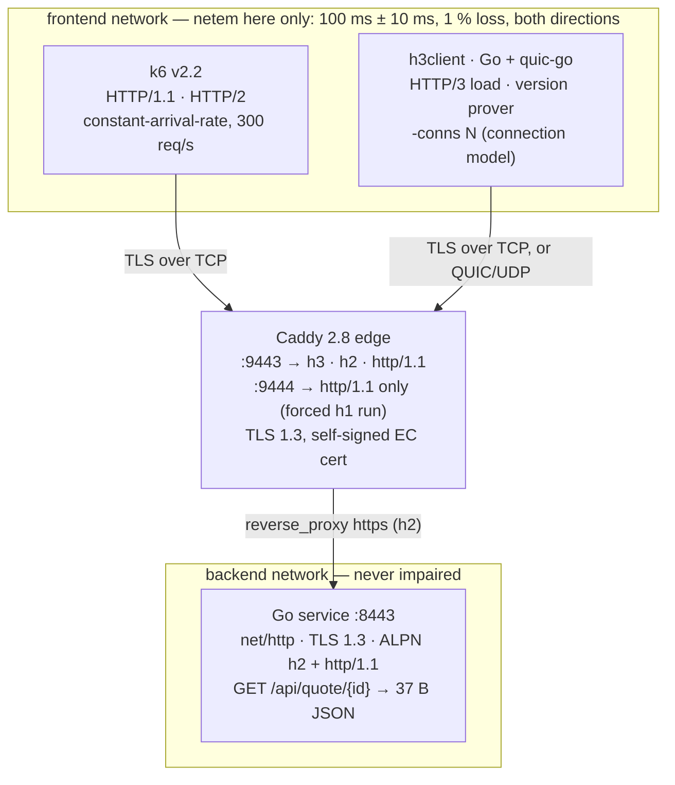

# Week 2 — Load Testing HTTP/1.1 vs HTTP/2 vs HTTP/3

Connection pooling and the cost of the TLS handshake, turned into numbers
measured on my own machine. The results and the three mechanism explanations
are in **[REPORT.md](REPORT.md)**.

## The rig

Everything runs in Linux containers (Docker Compose), because `netem` is a
Linux qdisc and the macOS host has no HTTP/3-capable `curl`.



| Component | What | Why |
|---|---|---|
| `service/` | Go `net/http`, one JSON endpoint, TLS 1.3, ALPN `h2` + `http/1.1` | The thing under test. No DB, no sleep, no per-request logging. |
| `edge/Caddyfile` | Caddy 2.8 on `:9443` (h3/h2/h1) and `:9444` (**h1-only**) | Go does not speak HTTP/3; Caddy does, in three lines. |
| `load/load.js` | k6 `constant-arrival-rate` | HTTP/1.1 and HTTP/2 runs; `COLD=1` disables connection reuse. |
| `load/h3client/` | Go + quic-go, open-loop, `-conns N` | HTTP/3 load, the negotiated-version proof for all three, and the **controlled connection-model** runs (h2 vs h3 with one connection each). |
| `netem/` | `tc qdisc … netem delay 100ms 10ms loss 1%` | Make localhost behave like the internet. |
| `run-all.sh` | Orchestrates every run → `results/` | Same endpoint, rate, duration everywhere; one variable at a time; validity guards. |

Two networks on purpose: netem hits only the client↔edge link. The edge↔service
hop is on a separate interface and stays clean, so h3's backend leg (which is
h2-over-TCP) cannot pollute the h2-vs-h3 loss comparison.

## Run it

```bash
bash certs/gen-cert.sh          # self-signed EC cert with SAN (lab only)
docker compose up -d --build
```

Prove which version you are actually speaking (**do not skip this**):

```bash
docker compose exec client h3client -mode prove -proto h1 -url https://edge:9444/api/quote/1
docker compose exec client h3client -mode prove -proto h2 -url https://edge:9443/api/quote/1
docker compose exec client h3client -mode prove -proto h3 -url https://edge:9443/api/quote/1
# expected negotiated=HTTP/1.1 / HTTP/2.0 / HTTP/3.0 with bytes=37 — anything else means the rig is lying
```

Run the whole suite (~12 minutes at the defaults). **Keep the machine awake
with the lid open** — see "Validity guards" below for why.

```bash
RATE=300 DURATION=60s bash run-all.sh
cat results/wallclock.txt        # VALID / INVALID verdict per run
```

Individual pieces:

```bash
# one k6 run (warm)                                  # the cold run (new connection per request)
docker compose exec k6 k6 run -e URL=https://edge:9443 -e NAME=h2 /load/load.js
docker compose exec k6 k6 run -e URL=https://edge:9443 -e NAME=h2_cold -e COLD=1 -e PREVUS=400 /load/load.js

# h3client at the same arrival rate as k6; -conns controls the connection model
docker compose exec client h3client -mode load -proto h3 -conns 1  -rate 300 -duration 60s -name h3
docker compose exec client h3client -mode load -proto h2 -conns 1  -rate 300 -duration 60s -name h2_1conn
docker compose exec client h3client -mode load -proto h3 -conns 50 -rate 300 -duration 60s -name h3_c50

# impair / clear the frontend link (run in edge AND the load containers)
for c in edge k6 client; do docker compose exec $c bash /netem/impair.sh; done
for c in edge k6 client; do docker compose exec $c bash /netem/clear.sh;  done
```

## Validity guards (and two discarded datasets)

The first two full runs of this suite were thrown away. The host went to sleep
mid-run (a 1-minute idle-sleep timer), the Docker VM paused with it, and k6 —
which schedules on the realtime clock — fired every missed iteration as a burst
on resume. The symptoms were a 60-second run reported as 58 minutes, single
"max" latencies of 100–600 s, and inflated p95/p99 that looked like protocol
behaviour and were nothing of the sort. So `run-all.sh` now:

- re-execs itself under `caffeinate -dims` so the host cannot idle-sleep;
- stamps every run with **host** wall-clock time and marks it `INVALID` (and
  retries, up to 3×) if that exceeds the configured duration by >20 s or if
  k6's own clock jumped (`k6_raw.clock_jump_suspected` in the summary);
- computes achieved RPS as iterations ÷ configured duration, because k6's
  `http_reqs.rate` was corrupted by the same clock jumps;
- aborts the impaired stage unless netem applied on every frontend interface
  **and** the measured RTT is ~2× the one-way delay (the first attempt
  silently skipped the edge because `tc` rejected `eth0@if328`).

## Deviations from the task sheet (stated, not hidden)

1. **Go instead of Java 21 / Spring Boot.** Consistent with Week 1. Go has no
   Tomcat thread pool; the server limits I state instead are the HTTP/2
   `MaxConcurrentStreams` and the server timeouts (see `service/main.go`).
   The protocol mechanisms under test are language-independent.
2. **quic-go instead of `curl --http3` / `h2load`.** There is no arm64 image of
   an HTTP/3-capable curl, so on Apple silicon that route does not exist.
   `h3client` reports the negotiated protocol from `res.Proto`, the same source
   of truth as curl's `%{http_version}`.
3. **Payloads are 37 B and 7.9 KB, not ~90 B and ~18 KB.** Go emits compact
   JSON. The report uses the measured sizes.
4. **All load is open-loop at the same rate.** A closed-loop tool would report
   "as fast as possible", which is not the same experiment.
5. **k6's "HTTP/2" is many connections, not one.** k6 gives each VU its own
   transport, so its h2 run multiplexes over ~hundreds of TCP connections,
   while `h3client -conns 1` is genuinely one connection. The fair h2-vs-h3
   comparison under loss therefore uses `h3client` for both with `-conns 1`;
   the k6 rows are kept as the task's primary tool and labelled accordingly.

## Where AI was used

Claude (Anthropic) was used as a pair-programmer for this week: scaffolding the
Docker rig, the Go service and h3 client, the k6 script, the netem and
orchestration scripts, and drafting the report structure. It also helped
diagnose the invalid runs described above. All measurements were run on my
machine, and I reviewed and can explain every result and every line of config.
